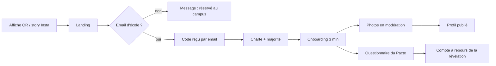

# 01 — Fonctionnalités

> Catalogue complet, priorisé. Chaque fonctionnalité a un identifiant stable réutilisé dans la [roadmap](09-roadmap.md).

**Priorités**

| Code | Signification |
|---|---|
| **P0** | Indispensable au lancement public (Pacte, février 2027) |
| **P1** | Printemps 2027, juste après le lancement |
| **P2** | Plus tard, si l'adoption est au rendez-vous |
| **R&D** | Exploratoire : prototype ou étude avant tout engagement |

---

## 1. Inscription et vérification (`ONB`)

| ID | Fonctionnalité | Prio | Détails |
|---|---|---|---|
| ONB-01 | Liste d'attente et course des écoles | P0 | Page d'attente avant l'ouverture : inscription par email d'école, compteur en direct par école, lien de parrainage. Voir [10 — Lancement](10-lancement.md). |
| ONB-02 | Connexion par code à usage unique | P0 | Email d'école uniquement (liste blanche de domaines par école), code à 6 chiffres valable 10 minutes, 5 essais maximum, limitation par IP et par adresse. Protection anti-robot (Cloudflare Turnstile). |
| ONB-03 | Passkeys | P0 | Après la première connexion, proposition d'enregistrer une passkey (Face ID, empreinte, Windows Hello) pour se reconnecter sans email. |
| ONB-04 | Majorité et charte | P0 | Date de naissance obligatoire (18 ans minimum, contrôle bloquant), acceptation de la charte communautaire sous forme de trois écrans courts et illustrés (respect, consentement, discrétion). |
| ONB-05 | Consentement aux données sensibles | P0 | Consentement explicite et séparé pour le genre recherché et l'orientation (données sensibles au sens du RGPD, voir [08](08-juridique-rgpd.md)). Refuser reste possible : on accède alors uniquement au mode Amis. |
| ONB-06 | Onboarding en trois minutes | P0 | Étapes : prénom → date de naissance → genre et pronoms → je cherche (Love, Amis, les deux) → qui je veux voir → photos (2 minimum) → 3 prompts → centres d'intérêt. Sauvegarde à chaque étape, reprise possible, barre de progression. |
| ONB-07 | École déduite de l'email | P0 | L'école est déterminée par le domaine et n'est pas modifiable par l'utilisateur. |
| ONB-08 | Vérification photo par geste | P1 | Selfie en reproduisant un geste aléatoire, comparé **manuellement** par un modérateur aux photos du profil. Badge « Photo vérifiée ». Pas de reconnaissance faciale automatique (évite le traitement de données biométriques). |
| ONB-09 | Re-vérification annuelle | P1 | Chaque mois de septembre, nouveau code envoyé sur l'email d'école. Sans validation sous 30 jours, le compte est mis en pause. Les diplômés gardent un accès en lecture 3 mois pour récupérer leurs conversations. |
| ONB-10 | Connexion Microsoft | R&D | Les cinq écoles utilisent chacune un tenant Microsoft 365. « Se connecter avec Microsoft » restreint à ces tenants, si leur politique de consentement le permet. Solution de secours si les emails de code sont filtrés. |
| ONB-11 | Connexion Forge ID (EPITA) | P1 | Le CRI de l'EPITA propose un fournisseur OpenID Connect ouvert aux projets étudiants sur demande ; il expose le campus et l'année de diplôme, ce qui **prouve** le statut d'étudiant à Lyon. Badge « Campus vérifié ». |
| ONB-12 | Campus et statut | P0 | Les domaines email sont nationaux et partagés avec le personnel : l'email prouve l'appartenance à l'école, pas le campus ni le statut d'étudiant. Déclaration obligatoire du campus et de la promo, interdiction explicite au personnel dans les CGU, signalement « ne fait pas partie du campus ». Vérification renforcée via ONB-11 quand c'est possible, et piste à étudier avec les services informatiques des écoles pour distinguer les comptes étudiants. |

## 2. Profil (`PRO`)

| ID | Fonctionnalité | Prio | Détails |
|---|---|---|---|
| PRO-01 | Photos | P0 | 2 à 6 photos. Recadrage et compression côté navigateur, réordonnancement par glisser-déposer, aperçu flou instantané (thumbhash), modération avant publication. |
| PRO-02 | Prompts | P0 | 3 réponses à choisir dans un catalogue orienté campus (voir § Prompts ci-dessous). 200 caractères maximum. |
| PRO-03 | Informations de base | P0 | Prénom, âge (calculé), école, cursus ou majeure, promo, pronoms, langues parlées, intentions (relation, voir ce qui se passe, amitié). |
| PRO-04 | Centres d'intérêt | P0 | Tags dans un catalogue fermé (pour éviter les tags offensants) + associations du campus. |
| PRO-05 | Score de complétude | P0 | Jauge et conseils actionnables (« Ajoute une photo où on voit ton visage »). |
| PRO-06 | Prompts vocaux | P1 | Réponse enregistrée de 30 secondes maximum, forme d'onde affichée, transcription pour l'accessibilité et la modération. |
| PRO-07 | Mon son du moment | P1 | Choix d'un morceau via une API de recherche musicale (extrait de 30 secondes). |
| PRO-08 | Carte de profil partageable | P1 | Carte holographique aux couleurs de l'école, exportable en image pour une story Instagram (« Je suis sur Atomes »). Contenu choisi par l'utilisateur. |
| PRO-09 | Champs optionnels assumés | P2 | Signe astrologique (traité avec humour), éditeur de code préféré, setup, plat du RU. |
| PRO-10 | Courte vidéo en boucle | P2 | 3 à 5 secondes, muette, sur le modèle des « Live Photos ». |
| PRO-11 | Texte alternatif des photos | P1 | Description saisie par l'utilisateur (suggestion facultative), lue par les lecteurs d'écran. |

**Exemples de prompts campus**

- « Le spot du campus où on me trouve… »
- « Mon pire bug / ma pire manip de TP… »
- « La matière que je pourrais enseigner les yeux fermés… »
- « Mon plus gros débat de projet de groupe… »
- « Mon plan parfait pour un dimanche à Lyon… »
- « Je te convaincs en un argument que… »
- « Mon green flag le plus sous-côté… »
- « Le meilleur souvenir de soirée BDE que je peux raconter ici… »

## 3. Découverte (`DEC`)

| ID | Fonctionnalité | Prio | Détails |
|---|---|---|---|
| DEC-01 | Deck de cartes | P0 | Une carte à la fois : photos, prompts, compatibilité. Actions : passer, liker, coup de cœur. Clavier (← →), boutons et gestes. |
| DEC-02 | Like ciblé avec commentaire | P0 | On like une photo ou un prompt précis, avec un commentaire facultatif de 150 caractères. Le like arrive avec son contexte : la conversation démarre toute seule. |
| DEC-03 | Quotas | P0 | Voir § Règles et quotas. Un like doit rester rare pour avoir de la valeur. |
| DEC-04 | Likes reçus | P0 | Liste gratuite et non floutée des personnes qui t'ont liké, avec le contenu liké et le commentaire. |
| DEC-05 | Compatibilité expliquée | P0 | Pourcentage calculé à partir du questionnaire, accompagné de 2 ou 3 raisons lisibles (« Vous détestez tous les deux les projets de groupe »). Voir [06](06-matching.md). |
| DEC-06 | Filtres | P0 | Mode (Love/Amis), tranche d'âge, écoles, promos, intentions. |
| DEC-07 | Le Drop | P1 | Chaque soir à 21 h, une sélection de 5 profils à forte compatibilité, disponible 24 heures. Rituel quotidien et antidote à l'épuisement du bassin. Peut passer en P0 si le planning le permet. |
| DEC-08 | Crush secret | P1 | On saisit l'email d'école d'une personne qu'on connaît (3 crushs actifs maximum). Si elle fait de même, match immédiat ; sinon, personne ne sait rien. Comparaison par empreintes cryptographiques, aucune notification si non réciproque. |
| DEC-09 | Seconde chance | P1 | Les profils passés reviennent après 45 jours, si le profil a changé de façon significative. |
| DEC-10 | Mode à l'aveugle | P2 | Une soirée par semaine, un deck sans photos (prompts et réponses uniquement). Les photos se révèlent après 10 messages de part et d'autre. |
| DEC-11 | Annuler le dernier choix | P1 | Un retour arrière par jour sur un « passer ». |

## 4. Matchs et conversations (`CHAT`)

| ID | Fonctionnalité | Prio | Détails |
|---|---|---|---|
| CHAT-01 | Écran de match | P0 | Moment signature animé (voir [02](02-design.md)), accès direct à la conversation. |
| CHAT-02 | Messagerie temps réel | P0 | Texte, emojis, réactions, réponses citées, indicateur de saisie, accusés de lecture (désactivables), statut en ligne (désactivable, visible uniquement par les matchs). Envoi optimiste, file d'attente hors ligne. |
| CHAT-03 | Brise-glace | P0 | Suggestions de premières questions tirées des profils des deux personnes (intérêts communs, prompts). Base de questions rédigée par l'équipe. |
| CHAT-04 | Brise-glace personnalisés par IA | P1 | Facultatif et désactivable. Suggestions générées à partir des prompts des deux profils, sans nom ni donnée sensible transmise. Jamais d'écriture automatique de messages. |
| CHAT-05 | GIF et stickers | P1 | Stickers maison aux couleurs des écoles en priorité ; GIF via GIPHY si la clé de production est obtenue (l'API Tenor a fermé en juin 2026). |
| CHAT-06 | Photos | P1 | Images floutées par défaut si le classifieur les juge explicites, avec « Afficher quand même » et « Signaler ». Option « vue unique ». |
| CHAT-07 | Messages vocaux | P1 | 2 minutes maximum, forme d'onde, vitesse de lecture, transcription. |
| CHAT-08 | Modifier / supprimer | P1 | Suppression pour tout le monde dans les 10 minutes ; modification avec mention « modifié ». |
| CHAT-09 | Relances douces | P1 | Pas d'expiration des matchs. Notification discrète après 3 jours de silence avec une suggestion de relance. |
| CHAT-10 | Proposer un date | P1 | Carte interactive : lieu (depuis les Spots), créneau, message. Accepter / proposer autre chose / décliner. Ajout au calendrier (.ics). |
| CHAT-11 | Mini-jeux | P2 | « Tu préfères », « Deux vérités, un mensonge », quiz de compatibilité nerd, joués à deux dans la conversation. |
| CHAT-12 | Appel vidéo « vibe check » | P2 | Appel de 15 minutes maximum, démarrage flouté jusqu'à ce que les deux acceptent, signalement possible pendant l'appel. |
| CHAT-13 | Unmatch / bloquer / signaler | P0 | Accessibles depuis la conversation et le profil, en deux gestes. |
| CHAT-14 | Playlist commune | P2 | Après un date accepté, playlist partagée générée à partir des « sons du moment ». |

## 5. Vie de campus et monde réel (`IRL`)

| ID | Fonctionnalité | Prio | Détails |
|---|---|---|---|
| IRL-01 | Événements | P1 | Les BDE et associations (rôle « organisateur ») publient leurs événements. « J'y vais » / « Peut-être ». Option : voir lesquels de ses matchs y vont (réciproque et facultatif). |
| IRL-02 | Spots | P1 | Carte stylisée des lieux de rendez-vous autour du campus et dans Lyon (cafés, bars, parcs, activités), filtres par budget et ambiance, bons plans partenaires. |
| IRL-03 | Kit sécurité date | P1 | Partager les détails de son date (lieu, heure, prénom du match) avec une personne de confiance via un lien temporaire ; message de vérification après le date ; accès direct aux numéros d'urgence et aux cellules d'écoute des écoles. |
| IRL-04 | Flash | P2 | Pendant un événement, chaque participant affiche un QR code dynamique (renouvelé toutes les 30 secondes). Se scanner mutuellement = match. |
| IRL-05 | Statut « Dispo » | P2 | « Dispo pour un café au campus jusqu'à 16 h », visible uniquement par ses matchs, expire automatiquement. |

## 6. Le Pacte (`PAC`)

Le Pacte est l'événement fondateur du produit et son moteur d'acquisition. Inspiré du *Marriage Pact* des campus américains.

| ID | Fonctionnalité | Prio | Détails |
|---|---|---|---|
| PAC-01 | Questionnaire | P0 | 40 à 50 questions (10 à 12 minutes) : valeurs, mode de vie, vie de campus, humour, projets. Chaque question : sa réponse, les réponses acceptables chez l'autre, l'importance. Sauvegarde continue. |
| PAC-02 | Matching global | P0 | Un seul match par personne et par mode (Love, Amis), calculé une fois pour tout le campus en maximisant la compatibilité globale. Seuil minimal : mieux vaut aucun match qu'un mauvais match. Voir [06](06-matching.md). |
| PAC-03 | Révélation en direct | P0 | Tout le campus découvre son match à la même minute. Compte à rebours, nombre de personnes connectées en direct, séquence de révélation animée, détail de la compatibilité. |
| PAC-04 | Statistiques du Pacte | P1 | Résultats agrégés et anonymisés (« 38 % du campus pense que l'ananas a sa place sur une pizza »), seuil d'anonymat de 10 personnes minimum. |
| PAC-05 | Éditions | P1 | Une édition par semestre : Saint-Valentin (février) et Rentrée (octobre, pour accueillir les nouveaux). |

## 7. Communauté et ludique (`COM`)

| ID | Fonctionnalité | Prio | Détails |
|---|---|---|---|
| COM-01 | Question de la semaine | P1 | Un sondage campus par semaine ; résultats en datavisualisation par école ; la réponse alimente la compatibilité. |
| COM-02 | Indice inter-écoles | P1 | Statistiques anonymisées des affinités entre écoles (« EPITA × Sup'Biotech : 128 matchs cette semaine »). Agrégats uniquement, jamais en dessous de 10. |
| COM-03 | Wrapped | P2 | Bilan de fin d'année au format story : nombre de matchs, emoji favori, heure de pointe… Uniquement des données de la personne, exportable si elle le souhaite. |
| COM-04 | Badges discrets | P2 | « Fondateur » (inscrit avant l'ouverture), « Photo vérifiée », « Ambassadeur ». Aucun badge lié à la popularité. |
| COM-05 | Easter eggs | P1 | Raccourcis `h`/`l` façon vim dans le deck, Konami code, mode terminal caché (`/terminal`), message dans la console du navigateur, page 404 jouable. |

## 8. Confidentialité et sécurité côté utilisateur (`SAF`)

| ID | Fonctionnalité | Prio | Détails |
|---|---|---|---|
| SAF-01 | Bloquer | P0 | Instantané, sans justification, réciproque (aucune des deux personnes ne voit plus l'autre), non notifié. |
| SAF-02 | Signaler | P0 | Depuis un profil, une photo, un message ou un événement. Motifs structurés, contexte joint automatiquement. Accusé de réception, puis notification de la décision. |
| SAF-03 | Masquer de mon école / ma promo | P0 | Réglages indépendants. Activés par défaut pour la promo ? À trancher en test utilisateur. |
| SAF-04 | Masquer des personnes précises | P0 | Liste d'emails (ex, colocataire, frère ou sœur, chargé de TD…). Stockée sous forme d'empreintes, la personne n'est jamais informée. |
| SAF-05 | Pause | P0 | Le profil disparaît du deck, les conversations restent accessibles. |
| SAF-06 | Notifications discrètes | P0 | Par défaut, les notifications ne révèlent ni prénom ni contenu (« Nouveau message »). |
| SAF-07 | Mode incognito | P1 | Seules les personnes que tu as likées peuvent voir ton profil. |
| SAF-08 | Mode partiels | P1 | Pause programmée jusqu'à une date, notifications coupées, retour automatique. |
| SAF-09 | Avertissement avant envoi | P1 | Si un message est détecté comme insultant ou déplacé : « Tu es sûr·e de vouloir envoyer ça ? ». |
| SAF-10 | « Ce message te dérange ? » | P1 | Côté destinataire, sur un message détecté comme potentiellement offensant : signalement en un geste. |
| SAF-11 | Floutage des images explicites | P1 | Voir CHAT-06. |
| SAF-12 | Filigrane dynamique | P2 | Les photos affichées portent un motif discret propre à la personne qui les regarde, pour dissuader les captures d'écran partagées. |
| SAF-13 | Verrouillage de l'application | P2 | Code ou biométrie à l'ouverture (utile en cas de prêt du téléphone). |
| SAF-14 | Export et suppression des données | P0 | Suppression self-service immédiate (effacement définitif sous 30 jours). Export complet (JSON + médias) en P1. |
| SAF-15 | Ressources d'aide | P0 | Page accessible partout : 17, 112, 114 (SMS), 3919, et les dispositifs de signalement et référents VSS de chaque école (plateformes de signalement de l'EPITA, de l'ESME et de Sup'Biotech, référente de l'ISG Lyon ; dispositif de l'IPSA à identifier). Liens vérifiés à chaque rentrée. |

## 9. Notifications (`NOT`)

| ID | Fonctionnalité | Prio | Détails |
|---|---|---|---|
| NOT-01 | Push web | P0 | Notifications push de l'application installée (Android, iOS 16.4+ une fois ajoutée à l'écran d'accueil, desktop). |
| NOT-02 | Centre de notifications | P0 | Historique in-app, pastilles de non-lus. |
| NOT-03 | Préférences fines | P0 | Par type (matchs, messages, likes, Drop, événements, Pacte), par canal (push, email). |
| NOT-04 | Heures calmes | P1 | Pas de notification entre 23 h et 8 h par défaut (sauf messages si l'utilisateur le souhaite). |
| NOT-05 | Résumé par email | P1 | Hebdomadaire et facultatif : likes reçus, événements de la semaine. |
| NOT-06 | Regroupement intelligent | P1 | Plusieurs messages rapprochés = une seule notification. |

## 10. Back-office (`ADM`)

| ID | Fonctionnalité | Prio | Détails |
|---|---|---|---|
| ADM-01 | File de modération des photos | P0 | Photos en attente, verdict des classifieurs, validation ou refus avec motif en un raccourci clavier. |
| ADM-02 | File des signalements | P0 | Priorisation par gravité, contexte (messages concernés), historique de la personne, actions graduées. |
| ADM-03 | Actions et motivations | P0 | Avertissement, restriction, suspension, bannissement ; chaque décision génère une motivation envoyée à la personne concernée (exigence du DSA). |
| ADM-04 | Recours | P1 | La personne sanctionnée peut contester ; réexamen par un autre modérateur. |
| ADM-05 | Journal d'audit | P0 | Toute action d'un modérateur ou d'un administrateur est tracée et non modifiable. |
| ADM-06 | Gestion des contenus | P0 | Prompts, questions, centres d'intérêt, lieux, textes légaux. |
| ADM-07 | Gestion du Pacte | P0 | Saisons, ouverture et fermeture, lancement du calcul, contrôle qualité des résultats, publication programmée. |
| ADM-08 | Espace organisateurs | P1 | Les BDE gèrent leurs événements. |
| ADM-09 | Tableaux de bord | P1 | Indicateurs produit, santé technique, délais de modération. |

## 11. Plateformes (`PLT`)

| ID | Fonctionnalité | Prio | Détails |
|---|---|---|---|
| PLT-01 | Application web progressive (PWA) | P0 | Installable, plein écran, push, mode hors ligne minimal. Guide d'installation animé, différent pour iOS et Android. |
| PLT-02 | Site vitrine | P0 | Landing page, Pacte, FAQ, sécurité, pages légales. |
| PLT-03 | Français | P0 | Langue par défaut. |
| PLT-04 | Anglais | P1 | Pour les étudiantes et étudiants internationaux. |
| PLT-05 | Applications natives iOS / Android | P2 | Expo (React Native), si l'usage le justifie. Voir [03](03-stack.md). |

---

## Règles et quotas (valeurs initiales, à ajuster avec les données)

| Règle | Valeur | Pourquoi |
|---|---|---|
| Likes par jour | 20 | Rareté ; le bassin est petit |
| Coups de cœur par jour | 1 | Signal fort, toujours accompagné d'un commentaire |
| Retour arrière par jour | 1 | Confort sans abus |
| Profils dans le Drop | 5 | Qualité, rituel |
| Crushs secrets actifs | 3 | Limite le risque d'abus |
| Messages par minute | 20 | Anti-spam |
| Comptes de moins de 48 h | 10 likes/jour, pas de photo en message | Limite l'impact d'un compte malveillant |
| Âge minimum | 18 ans | Légal et non négociable |
| Écart d'âge par défaut | ± 4 ans | Modifiable par l'utilisateur |

## Parcours principaux

### Premier contact

### Usage quotidien

1. 21 h : notification « Ton Drop est arrivé ».
2. Lecture du Drop, like ciblé sur un prompt avec un commentaire.
3. Le lendemain, like retour : écran de match.
4. La conversation démarre sur le commentaire du like ; brise-glace disponibles.
5. Proposition de date depuis la conversation, lieu choisi dans les Spots.
6. Kit sécurité : partage du date avec une amie.
7. Après le date : message de vérification, puis « Ça s'est bien passé ? » (retour anonyme qui améliore le matching).

### Signalement

1. Signaler depuis un message → motif → précisions facultatives.
2. Blocage proposé dans la foulée (une case cochée par défaut).
3. Accusé de réception immédiat.
4. Triage automatique (gravité, récidive) → file de modération priorisée.
5. Décision → motivation envoyée à la personne signalée, information envoyée à la personne qui a signalé.
6. Recours possible pour la personne sanctionnée.

---

## Banque d'idées (non planifiées)

- **Soirée speed-dating vidéo** : rounds de 4 minutes en visio un soir par mois, appariement en direct.
- **Mode duo** : s'inscrire à deux (amis) pour matcher avec un autre duo, pour les sorties à quatre.
- **Saisons thématiques** : semaine « EPITA × ISG » où ces deux écoles sont mises en avant l'une pour l'autre.
- **Bibliothèque de dates** : idées de dates notées par la communauté (anonymement), avec le budget.
- **Compatibilité musicale** : à partir des « sons du moment » des deux profils.
- **Badge « Premier date »** : le kit sécurité utilisé au moins une fois, valorisé comme un geste responsable.

## Idées écartées, et pourquoi

| Idée | Raison du rejet |
|---|---|
| Notation publique des profils | Toxique, contraire au principe d'équité |
| Score d'attractivité calculé par IA | Éthiquement inacceptable, biais connus |
| Géolocalisation en temps réel / « croisés aujourd'hui » | Risque de traque, sur un campus où tout le monde se connaît |
| Mur de confessions anonymes | Vecteur de harcèlement, ingérable en modération |
| Abonnement premium | Crée une inégalité dans un petit bassin, contraire au principe de gratuité |
| Expiration des matchs en 24 h | Stress inutile, et chaque match compte dans un petit bassin |
| Invitation anonyme par email d'une personne non inscrite (« quelqu'un a un crush sur toi ») | Détournable pour harceler ou spammer, et on écrirait à des personnes qui n'ont rien demandé |
| Classement des personnes les plus likées | Toxique, effet « superstar » |
