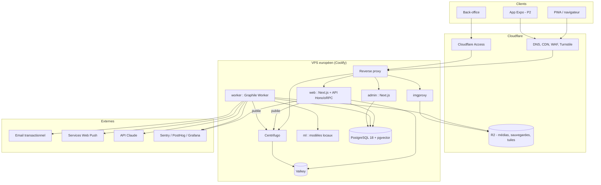
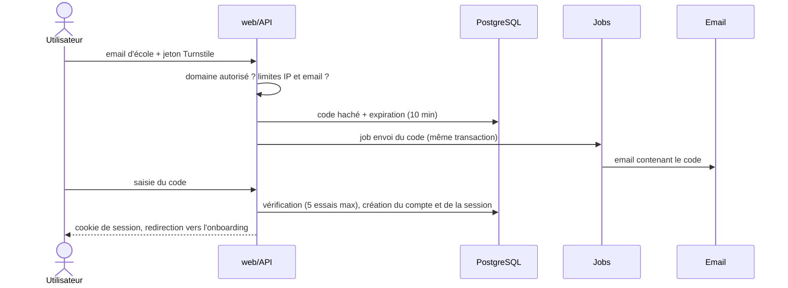
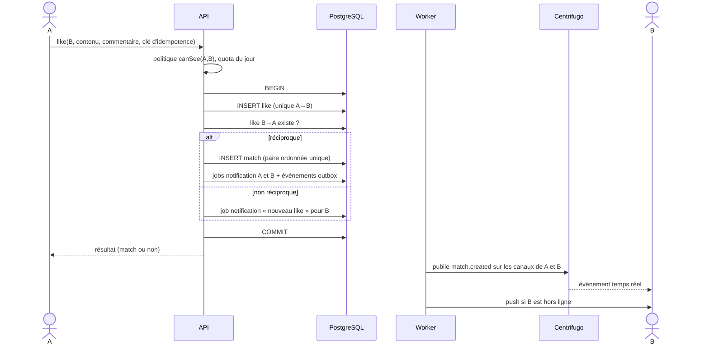
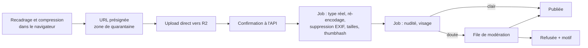

# 04 — Architecture

## 1. Vue d'ensemble



Principes :

- **Un seul point d'écriture** : toute mutation passe par l'API (validation, autorisation, quotas) puis par la base. Centrifugo ne fait que diffuser.
- **Asynchrone par défaut** pour tout ce qui est lent ou externe (images, emails, push, IA) : jobs Graphile Worker enregistrés dans la même transaction que l'écriture métier.
- **Back-office isolé** : application séparée, sous-domaine séparé, derrière Cloudflare Access + passkeys.
- **Médias isolés** : servis par imgproxy sur un domaine distinct, via des URL signées et expirantes.

## 2. Organisation du monorepo

```
atomes/
├── apps/
│   ├── web/          Next.js : site vitrine + application + API montée sous /api
│   ├── admin/        Next.js : modération, contenus, Pacte, tableaux de bord
│   ├── worker/       Graphile Worker : jobs, tâches planifiées, outbox
│   ├── pact-solver/  Python : calcul du Pacte (job ponctuel)
│   └── mobile/       Expo (P2)
├── packages/
│   ├── contracts/    Contrats oRPC + schémas Zod partagés
│   ├── api/          Routeur Hono/oRPC (handlers fins → core)
│   ├── core/         Domaine : services, politiques d'accès, matching, règles (TypeScript pur, testé)
│   ├── db/           Schéma Drizzle, migrations, seeds, requêtes complexes
│   ├── auth/         Configuration Better Auth
│   ├── realtime/     Noms de canaux, types d'événements, client et publication Centrifugo
│   ├── ui/           Design system (composants)
│   ├── tokens/       Jetons de design (source unique → CSS / TS)
│   ├── three/        Scènes 3D partagées (champ d'ions, éprouvettes)
│   ├── emails/       Gabarits React Email
│   ├── i18n/         Messages fr / en
│   ├── ml-client/    Client des modèles locaux et de l'API Claude
│   └── config/       tsconfig, Biome, presets partagés
├── infra/
│   ├── compose/      docker-compose (local et production)
│   ├── centrifugo/   Configuration
│   └── scripts/      Sauvegarde, restauration, rotation de clés
├── docs/             Ce plan, ADR, runbooks
└── .github/          CI, modèles d'issues et de PR, CODEOWNERS
```

Règle de dépendance : `apps/*` → `packages/api` → `packages/core` → `packages/db`. **`core` ne dépend d'aucun framework** (ni Next, ni Hono) : il est testable en isolation et réutilisable par le worker, le back-office et le mobile.

## 3. Domaine

| Module | Responsabilités |
|---|---|
| `identity` | Inscription, vérification d'école, sessions, passkeys, re-vérification annuelle |
| `profiles` | Profil, prompts, intérêts, préférences, complétude, visibilité |
| `media` | Téléversement, pipeline de traitement, URL signées |
| `discovery` | Candidats, deck, Drop, likes reçus, filtres |
| `matching` | Likes, matchs, crushs secrets, compatibilité, questionnaire |
| `messaging` | Conversations, messages, lectures, réactions, saisie |
| `pact` | Saisons, réponses, résultats, révélation |
| `campus` | Événements, Spots, question de la semaine, statistiques agrégées |
| `safety` | Blocages, masquages, signalements, sanctions, recours, journal d'audit |
| `notifications` | In-app, push, email, préférences, heures calmes |
| `policies` | **Toutes** les règles d'accès : `canSee`, `canViewProfile`, `canMessage`, `canViewMedia`, `canModerate` |

Les politiques sont des fonctions pures `(viewer, target, context) → décision`, testées par propriétés : par exemple « pour toute paire où l'un a bloqué l'autre, aucune lecture n'est autorisée, quel que soit le chemin ».

## 4. Flux principaux

### 4.1 Inscription par code



### 4.2 Like puis match



### 4.3 Envoi d'un message

1. Le client génère un identifiant UUIDv7 et affiche le message immédiatement (envoi optimiste).
2. `POST message.send` : la politique `canMessage` vérifie que le match est actif et qu'aucun blocage n'existe ; quotas ; palier 1 de modération (règles) synchrone.
3. Écriture en base (corps chiffré), job de modération asynchrone (palier 2), événement outbox.
4. Le worker publie `message.created` sur le canal du destinataire ; push si hors ligne.
5. L'identifiant client rend l'opération **idempotente** : un renvoi après coupure ne crée pas de doublon.

### 4.4 Téléversement d'une photo



### 4.5 Révélation du Pacte

Le moment le plus chargé de l'année : tout le campus se connecte à la même minute.

- Les résultats sont calculés et écrits en base **deux jours avant** ; la lecture d'un résultat est une simple requête indexée.
- La page de compte à rebours précharge toutes les ressources (animations, polices) avant l'heure.
- À l'heure dite, le worker publie un événement `pact.reveal` sur un canal de diffusion : tous les clients déclenchent la séquence au même instant.
- Le compteur de personnes connectées utilise la présence agrégée de Centrifugo.
- Test de charge k6 au moins une semaine avant (objectif : 3 000 connexions simultanées sans dégradation).

## 5. Temps réel

| Élément | Choix |
|---|---|
| Connexion | WebSocket vers Centrifugo, replis SSE / HTTP streaming |
| Authentification | JWT de connexion émis par l'API (durée courte, renouvelé automatiquement) |
| Canal personnel | `personal:#<userId>` : abonnement côté serveur, seul l'utilisateur peut le recevoir |
| Canal de conversation | `chat:<matchId>` pour la saisie en cours, avec jeton d'abonnement limité aux deux participants |
| Diffusion | `broadcast:pact` pour la révélation et les annonces |
| Récupération | Historique court sur les canaux personnels : les événements manqués pendant une coupure sont rejoués |

Événements : `match.created`, `like.received`, `message.created`, `message.read`, `message.deleted`, `reaction.updated`, `typing`, `presence`, `drop.ready`, `pact.reveal`, `moderation.notice`.

Les types d'événements sont définis une seule fois dans `packages/realtime` et partagés par l'émetteur et les clients.

## 6. Conventions d'API

- Procédures oRPC regroupées par module (`profiles.update`, `discovery.deck`, `messaging.send`…).
- **Pagination par curseur** (UUIDv7 ou horodatage), jamais par décalage.
- **Idempotence** de toutes les mutations sensibles (like, message, signalement) via une clé fournie par le client.
- **Erreurs typées** : code stable, message lisible, détails de validation.
- **Limitation de débit** par procédure, par utilisateur et par IP (Valkey, fenêtre glissante).
- Documentation OpenAPI générée, consultable en interne.

## 7. Cache et performance

| Donnée | Stratégie |
|---|---|
| Site vitrine | Statique, CDN Cloudflare |
| Compteurs de la liste d'attente | `'use cache'` avec revalidation courte + mise à jour temps réel |
| Deck | Candidats pré-calculés en Valkey, filtrés au moment de servir |
| Données de l'application | TanStack Query, mises à jour optimistes, invalidation par événements temps réel |
| Images | imgproxy + CDN, aperçu thumbhash immédiat |
| Profils consultés | Préchargement des 3 prochaines cartes du deck (images comprises) |

## 8. Environnements

| Environnement | Rôle | Données |
|---|---|---|
| Local | `docker compose` : PostgreSQL, Valkey, Centrifugo, imgproxy, SeaweedFS, Mailpit (capture des emails) | Seed : ~2 000 profils fictifs avec avatars générés (aucun vrai visage) |
| Prévisualisation | Une instance par pull request (Coolify) | Seed |
| Préproduction | Copie de la configuration de production | Seed + scénarios de test |
| Production | VPS principal | Réelles |

Configuration validée au démarrage par un schéma Zod : une variable manquante empêche le démarrage au lieu de provoquer une erreur plus tard.

## 9. Évolution

L'architecture tient sans modification jusqu'à plusieurs dizaines de milliers d'utilisateurs. Si le projet s'étend à d'autres campus IONIS :

1. Base de données sur un serveur dédié (ou PostgreSQL géré européen), réplique en lecture.
2. Plusieurs instances `web` derrière le proxy, Centrifugo en mode cluster sur Valkey.
3. Données partitionnées logiquement par campus (`campus_id` présent dès le premier jour).
4. Extraction de l'API en service autonome (`apps/api`) si le mobile le justifie.
