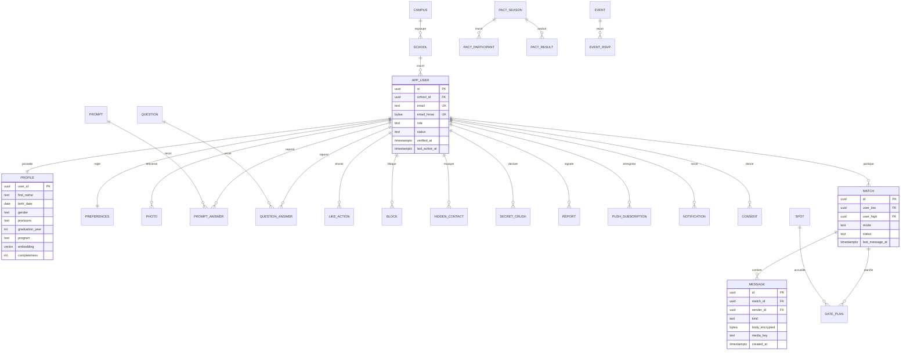

# 05 — Modèle de données

> Modèle conceptuel de départ. Le schéma de référence sera le code Drizzle dans `packages/db` ; ce document en donne l'intention et les règles.

## 1. Conventions

- Clés primaires `uuid` générées par `uuidv7()` (natif PostgreSQL 18) : triables dans le temps, sans collision, sans révéler de compteur.
- Dates en `timestamptz`, toujours en UTC ; affichage en `Europe/Paris`.
- Noms de tables et colonnes en anglais, `snake_case`.
- Énumérations en `text` + contrainte `CHECK` (plus simples à faire évoluer que les types `ENUM`).
- `campus_id` présent sur les entités qui en dépendent dès le premier jour (extension future à d'autres campus).
- Suppression logique uniquement là où elle est nécessaire (comptes en cours de suppression) ; ailleurs, suppression réelle.
- Toute contrainte métier critique est **aussi** une contrainte en base (unicité, clé étrangère, `CHECK`).

## 2. Schéma conceptuel

## 3. Tables

### Identité et comptes

| Table | Colonnes clés | Contraintes et remarques |
|---|---|---|
| `campus` | `id`, `slug` (`lyon`), `name`, `timezone` | — |
| `school` | `id`, `campus_id`, `slug`, `name`, `email_domains text[]`, `color`, `foil` | Configuration : ajouter une école = ajouter une ligne |
| `app_user` | `id`, `school_id`, `email`, `email_hmac`, `role` (`user`, `organizer`, `moderator`, `admin`), `status` (`onboarding`, `active`, `paused`, `restricted`, `suspended`, `banned`, `deleting`), `verified_at`, `reverify_due_at`, `last_active_at` | `email` unique (en minuscules) ; `email_hmac` = HMAC-SHA256 avec un sel secret, pour les recherches sans exposer l'adresse |
| Tables Better Auth | `session`, `account`, `verification`, `passkey` | Générées par Better Auth, préfixées |
| `consent` | `user_id`, `kind` (`terms`, `privacy`, `sensitive_data`, `ai_features`, `email_digest`), `version`, `granted_at`, `withdrawn_at` | Preuve du consentement, historisée |
| `identity_vault` | `user_id`, `email`, `first_name`, `birth_date`, `created_ip`, `closed_at`, `purge_after` | Conservation légale après clôture (voir [08](08-juridique-rgpd.md)) ; accès restreint et tracé |

### Profil

| Table | Colonnes clés | Contraintes et remarques |
|---|---|---|
| `profile` | `user_id`, `first_name`, `birth_date`, `gender`, `pronouns`, `program`, `graduation_year`, `languages text[]`, `intentions text[]`, `anthem` (jsonb), `embedding vector(384)`, `completeness` | Âge calculé, jamais stocké ; `birth_date` ≤ aujourd'hui − 18 ans |
| `preferences` | `user_id`, `modes text[]` (`love`, `friends`), `interested_in text[]`, `age_min`, `age_max`, `school_filter uuid[]`, `hide_from_own_school`, `hide_from_own_year`, `incognito`, `cross_school_boost` | `interested_in` = donnée sensible : jamais exposée, jamais envoyée à l'analytique |
| `photo` | `id`, `user_id`, `storage_key`, `position`, `width`, `height`, `thumbhash`, `alt_text`, `status` (`pending`, `approved`, `rejected`), `moderation` (jsonb) | 6 photos maximum ; positions uniques par utilisateur |
| `prompt` | `id`, `text_fr`, `text_en`, `category`, `active` | Catalogue |
| `prompt_answer` | `user_id`, `prompt_id`, `text`, `voice_key`, `transcript`, `position` | 3 réponses texte maximum |
| `interest` / `profile_interest` | Catalogue fermé de tags + association | — |
| `association` / `profile_association` | Associations du campus | — |

### Découverte et matching

| Table | Colonnes clés | Contraintes et remarques |
|---|---|---|
| `question` | `id`, `section`, `text_fr`, `text_en`, `options` (jsonb), `version`, `active`, `pact_only` | Catalogue versionné |
| `question_answer` | `user_id`, `question_id`, `answer`, `acceptable text[]`, `importance` | Unique (`user_id`, `question_id`) |
| `like_action` | `id`, `actor_id`, `target_id`, `kind` (`like`, `superlike`, `pass`), `target_content` (photo ou prompt), `comment`, `created_at` | Unique (`actor_id`, `target_id`) ; `actor_id <> target_id` |
| `match` | `id`, `user_low`, `user_high`, `mode`, `source` (`like`, `crush`, `pact`, `flash`), `status` (`active`, `unmatched`), `unmatched_by`, `last_message_at` | Paire ordonnée (`user_low < user_high`) unique : impossible de créer deux matchs pour la même paire |
| `secret_crush` | `user_id`, `target_email_hmac`, `created_at`, `expires_at` | 3 actifs maximum par utilisateur |
| `drop` | `id`, `user_id`, `day`, `candidates uuid[]`, `opened_at` | Unique (`user_id`, `day`) |
| `impression` | `viewer_id`, `target_id`, `surface`, `day`, `count` | Agrégée par jour ; sert à l'équité d'exposition |

### Messagerie

| Table | Colonnes clés | Contraintes et remarques |
|---|---|---|
| `message` | `id` (UUIDv7 fourni par le client), `match_id`, `sender_id`, `kind` (`text`, `image`, `voice`, `gif`, `date_proposal`, `system`), `body_encrypted`, `key_id`, `media_key`, `reply_to`, `created_at`, `edited_at`, `deleted_at`, `moderation` (jsonb) | Index (`match_id`, `id`) ; corps chiffré côté application |
| `message_read` | `match_id`, `user_id`, `last_read_message_id` | Unique (`match_id`, `user_id`) |
| `reaction` | `message_id`, `user_id`, `emoji` | Unique (`message_id`, `user_id`) |
| `date_plan` | `id`, `match_id`, `proposer_id`, `spot_id`, `starts_at`, `status`, `safety_share_token`, `checkin_at` | — |

### Sécurité et modération

| Table | Colonnes clés | Contraintes et remarques |
|---|---|---|
| `block` | `blocker_id`, `blocked_id`, `created_at` | Unique ; effet immédiat dans les deux sens |
| `hidden_contact` | `user_id`, `email_hmac` | Masquage par adresse, sans stocker l'adresse en clair |
| `report` | `id`, `reporter_id`, `reported_id`, `context` (`profile`, `photo`, `message`, `event`), `context_ref`, `reason`, `details_encrypted`, `priority`, `status`, `assigned_to`, `created_at` | — |
| `moderation_action` | `id`, `report_id`, `target_user_id`, `moderator_id`, `action`, `rule`, `statement` (motivation envoyée), `expires_at`, `created_at` | Motivation obligatoire |
| `appeal` | `id`, `action_id`, `text`, `status`, `reviewer_id`, `decided_at` | Réexamen par un autre modérateur (contrainte applicative) |
| `audit_log` | `id`, `actor_id`, `action`, `target_type`, `target_id`, `metadata`, `created_at` | Ajout seul : aucun droit `UPDATE` ni `DELETE` pour le rôle applicatif |

### Pacte, campus, notifications

| Table | Colonnes clés |
|---|---|
| `pact_season` | `id`, `name`, `opens_at`, `closes_at`, `reveal_at`, `status`, `threshold` |
| `pact_participant` | `season_id`, `user_id`, `modes`, `completed_at` |
| `pact_result` | `season_id`, `mode`, `user_low`, `user_high`, `score`, `explanation` (jsonb) |
| `event` | `id`, `organizer_id`, `title`, `description`, `starts_at`, `venue`, `cover_key`, `school_ids`, `status` |
| `event_rsvp` | `event_id`, `user_id`, `status`, `share_with_matches` |
| `spot` | `id`, `name`, `category`, `address`, `location` (lat/lng), `price_level`, `deal`, `photos` |
| `weekly_question` / `weekly_answer` | Question de la semaine et réponses |
| `notification` | `id`, `user_id`, `type`, `payload`, `read_at`, `created_at` |
| `push_subscription` | `id`, `user_id`, `endpoint`, `keys`, `user_agent`, `last_success_at` |
| `outbox` | `id`, `topic`, `payload`, `created_at`, `published_at` |
| `waitlist` | `id`, `email_hmac`, `school_id`, `referral_code`, `referred_by`, `created_at` |

## 4. Classification des données

| Classe | Exemples | Protections |
|---|---|---|
| **Visible dans l'application** | Prénom, âge, photos, prompts, école, promo | Visible uniquement par les personnes éligibles (politiques) ; jamais public sur le web |
| **Restreinte** | Date de naissance, genre, préférences, réponses au questionnaire, likes | Jamais affichée telle quelle, jamais envoyée à l'analytique |
| **Sensible** | Genres recherchés (orientation), conversations | Consentement explicite ; corps des messages chiffré côté application ; accès modération uniquement via signalement |
| **Secrète** | Email, IP, secrets d'authentification, signalements | Accès restreint, tracé ; empreintes HMAC partout où c'est possible |

## 5. Chiffrement applicatif

- Corps des messages et détails des signalements chiffrés avec libsodium (`secretbox`), clé de données par lot, clés maîtresses hors base (gestionnaire de secrets).
- Colonne `key_id` : rotation des clés sans tout rechiffrer d'un coup.
- Conséquence assumée : pas de recherche plein texte dans les messages.
- Les préférences (`interested_in`) restent en clair car elles sont indispensables aux requêtes de matching ; elles sont protégées par le contrôle d'accès, le chiffrement des disques et l'exclusion de tout export analytique.

## 6. Index principaux

| Index | Usage |
|---|---|
| `app_user (status, last_active_at)` partiel sur `status = 'active'` | Génération de candidats |
| `profile (graduation_year)`, `profile (birth_date)` | Filtres |
| `like_action (target_id, created_at)` | Likes reçus |
| `match (user_low)`, `match (user_high)` | Liste des conversations |
| `message (match_id, id DESC)` | Historique paginé |
| `profile USING hnsw (embedding vector_cosine_ops)` | Similarité |
| `block (blocked_id)` | Filtrage dans les deux sens |
| `audit_log (target_type, target_id)` | Historique de modération |

## 7. Rétention et purge

Les durées sont définies dans [08 — Juridique](08-juridique-rgpd.md#34-durées-de-conservation). Leur application est **automatique** : un job quotidien purge ce qui a expiré et écrit un compte rendu (nombre de lignes, sans contenu) dans le journal d'audit.

Suppression d'un compte :

1. Immédiatement : statut `deleting`, profil invisible, sessions révoquées, matchs clos.
2. Copie des données d'identification légales dans `identity_vault`.
3. Sous 30 jours : suppression définitive du profil, des photos (stockage objet compris), des likes, des réponses, des messages (sauf ceux rattachés à un signalement ouvert).
4. À expiration des délais légaux : purge de `identity_vault`.

## 8. Données de développement

- Seed déterministe de ~2 000 profils fictifs répartis entre les cinq écoles selon des proportions réalistes, avec des avatars générés (aucun visage réel), des réponses au questionnaire cohérentes et un historique de likes simulé.
- Sert aux tests du matching, aux tests de charge et aux démonstrations.
- **Jamais de copie des données de production** en local ou en préproduction.
