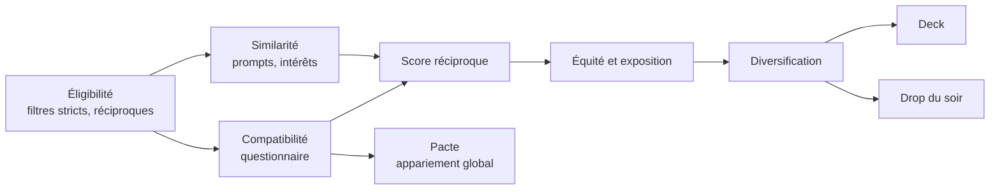

# 06 — Matching et algorithmes

> Contexte déterminant : **le bassin est petit** (quelques milliers de personnes au plus). À cette échelle, un modèle d'apprentissage profond n'apporte rien ; un système de règles explicites, un questionnaire bien conçu et une attention forte à l'équité donnent de meilleurs résultats et restent explicables.

## 1. Vue d'ensemble

## 2. Éligibilité (filtres stricts)

Une paire (A, B) n'est jamais proposée si l'une de ces conditions échoue. **Toutes les conditions sont vérifiées dans les deux sens.**

| Condition | Détail |
|---|---|
| Mode | A et B partagent au moins un mode actif (Love, Amis) |
| Genre et orientation | En mode Love : le genre de B fait partie des genres recherchés par A, et réciproquement |
| Âge | L'âge de B est dans la tranche de A, et réciproquement |
| Blocage | Aucun blocage dans un sens ou dans l'autre |
| Masquage | B n'a pas masqué l'école ou la promo de A, ni l'email de A (et réciproquement) |
| État du compte | Compte actif, ni en pause, ni suspendu, profil complet, au moins une photo validée |
| Incognito | Si B est en incognito, B n'est visible que si B a liké A |
| Historique | Pas de like ou de « passer » récent de A vers B (sauf seconde chance, voir DEC-09) |
| Activité | B actif dans les 21 derniers jours |
| Dealbreakers | Si A a marqué une réponse « obligatoire » et que B ne la satisfait pas |

Ces règles vivent dans **une seule fonction de politique** du domaine (`canSee(viewer, target)`), réutilisée par le deck, le Drop, le Pacte, les likes reçus et les profils. Elle est couverte par des tests basés sur les propriétés (voir [11](11-qualite-ops.md)).

## 3. Compatibilité par questionnaire

Méthode inspirée de celle popularisée par OkCupid : explicable et robuste avec peu de données.

Pour chaque question *q*, chaque personne donne :

- sa réponse $a_q$ ;
- les réponses qu'elle accepte chez l'autre $S_q$ ;
- l'importance $w_q \in \{0, 1, 10, 50, 250\}$ (sans importance, un peu, assez, très, obligatoire).

Satisfaction de A vis-à-vis de B, sur l'ensemble $Q$ des questions auxquelles les deux ont répondu :

$$
s(A \to B) = \frac{\sum_{q \in Q} w^A_q \cdot \mathbb{1}\left[a^B_q \in S^A_q\right]}{\sum_{q \in Q} w^A_q}
$$

Compatibilité, avec une correction de la marge d'erreur quand peu de questions sont communes :

$$
C(A,B) = \max\left(0,\ \sqrt{s(A \to B)\cdot s(B \to A)} - \frac{1}{|Q|}\right)
$$

- Affichée uniquement si $|Q| \ge 12$.
- La moyenne géométrique pénalise les compatibilités à sens unique.
- **Explication** : on affiche les 2 accords les plus pondérés et, pour l'humour, un désaccord mineur (« Vous n'êtes pas d'accord sur l'ananas. Personne n'est parfait. »).

### Conception du questionnaire

| Section | Exemples |
|---|---|
| Valeurs | Ce qui compte dans une relation, rapport à l'engagement, partage des tâches |
| Mode de vie | Lève-tôt ou couche-tard, sport, sorties, rapport à l'alcool et au tabac |
| Campus | Place en amphi, rôle en projet de groupe, méthode de révision |
| Humour et nerd | Tabulations ou espaces, mode sombre, ananas sur la pizza |
| Projets | Mobilité internationale, ville de rêve, rythme de vie souhaité |

Règles :

- **Aucune question sur la religion, les opinions politiques, la santé ou l'origine** : ce sont des données sensibles au sens du RGPD et elles n'apportent pas assez pour justifier le risque.
- Pas de prétention psychométrique : on présente le questionnaire comme un jeu sérieux, pas comme un test scientifique.
- Questions relues par un panel mixte des cinq écoles avant publication.
- Catalogue versionné : une question retirée n'invalide pas les anciennes réponses.

## 4. Similarité de contenu

- **Plongements vectoriels** des prompts et des centres d'intérêt, calculés par un modèle multilingue open source hébergé chez nous (aucune donnée envoyée à un tiers), stockés avec `pgvector`.
- **Jaccard** sur les tags d'intérêts et les associations.
- Utilisée comme signal secondaire et pour générer des brise-glace (« Vous faites tous les deux de l'escalade »).

## 5. Score réciproque

Un bon système de recommandation pour une application de rencontre ne cherche pas « qui A va aimer » mais **« quelle paire va s'aimer mutuellement »** (recommandation réciproque).

$$
R(A,B) = \sqrt{\hat{p}(A \text{ like } B)\cdot \hat{p}(B \text{ like } A)}
$$

- **Phase 1 (lancement)** : $\hat{p}$ est une fonction logistique de signaux pondérés à la main : compatibilité, similarité, complétude du profil, activité récente, écart de promo, affinités historiques entre écoles.
- **Phase 2 (quand il y a assez de données, quelques dizaines de milliers de décisions)** : régression logistique ou gradient boosting entraîné sur les likes observés, évalué hors ligne avant toute mise en production.

## 6. Équité et exposition

Problème connu des applications de rencontre : une petite fraction des profils reçoit l'essentiel des likes. Ces profils sont submergés, les autres sont invisibles, et tout le monde finit frustré.

Mécanismes :

1. **Plafond d'attention** : quand une personne a beaucoup de likes reçus en attente de réponse, son exposition dans les decks des autres diminue jusqu'à ce qu'elle ait traité sa file.
2. **Budget d'impressions** : chaque profil vise une exposition quotidienne cible ; au-delà, son score est progressivement atténué.
3. **Coup de pouce aux nouveaux** : exposition renforcée pendant 72 heures pour recueillir du signal (exploration).
4. **Bonus inter-écoles** (réglable) : léger bonus aux paires de deux écoles différentes, puisque le brassage fait partie de la mission.

Score final de classement :

$$
\text{score}(A,B) = R(A,B)\cdot\left(1 + \beta_{\text{nouveau}}(B) + \beta_{\text{actif}}(B) + \beta_{\text{inter-école}}(A,B)\right)\cdot \pi_{\text{exposition}}(B)
$$

**Indicateurs de suivi** : coefficient de Gini des likes reçus (à faire baisser), part de profils n'ayant reçu aucun like en 7 jours, répartition de l'exposition par école et par genre.

## 7. Composition du deck

1. Génération de candidats : les ~300 meilleurs profils éligibles, recalculés chaque nuit et mis à jour au fil de l'eau.
2. Classement par `score`.
3. **Diversification** (Maximal Marginal Relevance) : on évite d'enchaîner des profils trop similaires et on alterne les écoles.
4. **Intercalage des likes reçus** : environ une carte sur quatre est une personne qui t'a déjà liké (si elle existe), ce qui augmente fortement le taux de match.
5. Au moment de servir, filtrage temps réel (blocages, likes effectués entre-temps).

## 8. Le Drop

Chaque soir, chaque personne reçoit 5 profils, avec une contrainte : **un même profil n'apparaît pas dans plus de *c* Drops par jour** (≈ 10). Sans cette contrainte, les mêmes profils populaires seraient dans tous les Drops.

C'est un problème d'affectation sous contraintes de capacité (*b-matching*) :

- **Version 1** : glouton. On trie toutes les paires éligibles par score décroissant et on affecte tant que A a moins de 5 profils et B moins de *c* apparitions. Rapide (quelques secondes pour quelques milliers de personnes) et suffisant.
- **Version 2 si nécessaire** : flot à coût minimum pour une affectation optimale.

Calcul à 20 h 30, publication et notifications à 21 h. Les profils du Drop sont exclus du deck du même jour.

## 9. Le Pacte

Objectif : **un seul match par personne et par mode**, choisi pour maximiser la qualité globale des paires, révélé à tout le campus au même moment.

### Formulation

- Un graphe par mode (Love, Amis). Les sommets sont les participants.
- Une arête entre A et B si la paire est éligible (section 2) et si $C(A,B) \ge \theta$ (seuil initial : 0,60). **Mieux vaut aucun match qu'un mauvais match.**
- Poids de l'arête : $C(A,B)$ (variante : $C(A,B)^2$ pour favoriser les excellentes paires).
- On cherche un **couplage de poids maximum** dans ce graphe. Le graphe n'est pas biparti (les orientations sont diverses), il faut donc un algorithme pour graphes généraux (algorithme d'Edmonds, dit des « fleurs »).

### Mise en œuvre

| Étape | Choix |
|---|---|
| Préparation | Calcul des compatibilités, sparsification aux 50 meilleurs voisins de chaque personne |
| Solveur, prototype | `networkx.max_weight_matching` (Python), à mesurer sur des données synthétiques de 3 000 personnes |
| Solveur, si trop lent | Programme en nombres entiers avec OR-Tools CP-SAT (une variable par arête, au plus une arête par sommet) |
| Variante équité | Maximiser d'abord la compatibilité minimale, puis la somme (optimisation lexicographique), si l'équipe préfère éviter les matchs « juste au-dessus du seuil » |
| Contrôle qualité | Distribution des compatibilités, part inter-écoles, vérification manuelle d'un échantillon anonymisé, tests de non-régression des règles d'éligibilité |
| Publication | Résultats écrits en base, révélation déclenchée à l'heure dite par un événement temps réel diffusé à tous |

Le calcul tourne dans un job ponctuel (conteneur Python dédié), pas dans l'API. Il est **rejoué à blanc** sur des données synthétiques une semaine avant, puis sur les vraies données deux jours avant la révélation, pour laisser le temps de corriger.

## 10. Quotas et anti-abus

Voir les valeurs dans [01 — Fonctionnalités](01-fonctionnalites.md#règles-et-quotas-valeurs-initiales-à-ajuster-avec-les-données). Côté algorithme :

- Un compte qui like à un rythme anormal (par exemple 20 likes en moins d'une minute) est ralenti.
- Les likes d'un compte suspendu sont neutralisés.
- Aucune note de désirabilité n'est exposée, même indirectement.

## 11. Évaluation et expérimentation

- **Hors ligne** : sur l'historique, taux de likes réciproques parmi les K premiers profils proposés.
- **En ligne** : tests A/B via les feature flags, sur des métriques de résultat (conversations réciproques, dates proposés), avec des **garde-fous** : taux de signalement, Gini des likes, part inter-écoles. Une variante qui améliore le taux de match mais dégrade un garde-fou n'est pas retenue.
- Taille du bassin oblige : peu de tests simultanés, durées longues, prudence dans l'interprétation.

## 12. Transparence

- Une page publique explique les principaux paramètres du classement (compatibilité, activité, équité d'exposition, bonus inter-écoles) et ce qui n'est **jamais** utilisé (apparence physique, origine, données sensibles hors préférences déclarées).
- L'utilisateur dispose de réglages : filtres, désactivation du bonus inter-écoles, ordre « aléatoire » du deck.
- Les choix de conception sont documentés dans un ADR à chaque évolution significative.
