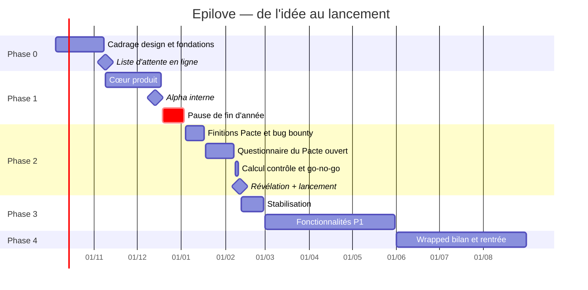

# 09 — Roadmap

> Point de départ : **vendredi 2 octobre 2026**. Jalon structurant : **révélation du Pacte et ouverture publique le jeudi 11 février 2027 à 20 h**, trois jours avant la Saint-Valentin (dimanche 14), pour laisser à chacun le week-end pour proposer un date.

## Vue d'ensemble

Les calendriers des cinq écoles (partiels, vacances) ne sont pas publiés : **à collecter auprès des BDE dès la première semaine** et à reporter ici. Pour mémoire, les vacances scolaires de la zone A (que les écoles ne suivent pas forcément) : Toussaint du 17 octobre au 2 novembre 2026, Noël du 19 décembre au 4 janvier, hiver du 13 février au 1ᵉʳ mars 2027. La révélation du 11 février tombe juste avant ces vacances d'hiver : à vérifier école par école.

---

## Phase 0 — Cadrage et fondations (5 octobre → 8 novembre 2026)

**Objectif** : une équipe, une structure, une direction artistique, des fondations techniques, et la liste d'attente en ligne.

| Semaine | Livrables |
|---|---|
| S41 (5 oct.) | Équipe et rôles ; vote du nom ; demande de calendrier aux BDE ; **test de délivrabilité des emails vers les cinq domaines d'école** ; demande d'accès Forge ID (EPITA) ; monorepo initialisé |
| S42 (12 oct.) | Statuts de l'association déposés ; planches d'ambiance (3 directions) ; CI (lint, types, tests) ; environnement local `docker compose` |
| S43 (19 oct.) | Direction artistique choisie ; prototype du champ d'ions (WebGPU/WebGL2) ; preuve de concept Centrifugo ; préproduction déployée |
| S44 (26 oct.) | Logo, palette, typographies ; maquettes de la landing ; schéma de base v1 ; authentification par code fonctionnelle |
| S45 (2 nov.) | Landing + liste d'attente + course des écoles terminées et testées ; mentions légales et politique de confidentialité de la liste d'attente |

**Critères de sortie** : liste d'attente en ligne le **lundi 9 novembre** ; délivrabilité validée sur les cinq domaines (ou plan B activé) ; association déclarée ; direction artistique figée.

## Phase 1 — Cœur produit (9 novembre → 18 décembre 2026)

**Objectif** : une application utilisable de bout en bout par un petit groupe.

| Epic | Contenu | IDs |
|---|---|---|
| E1 Identité | Code, passkeys, majorité, charte, consentements, campus | ONB-02 → 07, ONB-12 |
| E2 Profil | Photos et pipeline, prompts, intérêts, complétude | PRO-01 → 05 |
| E3 Modération v1 | Files photos et signalements, actions, motivations, journal d'audit | ADM-01 → 03, ADM-05 |
| E4 Questionnaire | Moteur de questions, compatibilité, explications | PAC-01, DEC-05 |
| E5 Découverte | Candidats, deck, likes ciblés, likes reçus, filtres, quotas | DEC-01 → 04, DEC-06 |
| E6 Messagerie | Temps réel, envoi optimiste, lectures, réactions, brise-glace | CHAT-01 → 03, CHAT-13 |
| E7 Notifications | Push web, centre de notifications, préférences | NOT-01 → 03 |
| E8 Sécurité utilisateur | Bloquer, signaler, masquer, pause, notifications discrètes, suppression, ressources | SAF-01 → 06, SAF-14, SAF-15 |
| E9 Design system | Composants P0, Storybook, moments signature 3 à 6 | — |

**Jalon** : alpha interne le **lundi 14 décembre** (équipe + ~30 proches, toutes écoles confondues).

**Critères de sortie** : parcours complet (inscription → match → conversation → signalement) sans bug bloquant ; aucune faille de sécurité connue de gravité élevée ; AIPD rédigée en version de travail.

## Pause de fin d'année (19 décembre → 3 janvier)

Uniquement des corrections et de la préparation de contenus (questions du Pacte, prompts, textes). Pas de nouvelle fonctionnalité.

## Phase 2 — Pacte et bêta (4 janvier → 10 février 2027)

| Période | Livrables |
|---|---|
| 4 → 17 janv. | Finitions ; interface du questionnaire du Pacte ; solveur du Pacte et **répétitions sur données synthétiques** ; section Pacte de la landing ; tests de charge ; formation des modérateurs ; **bug bounty interne** (11 → 24 janv.) ; documents juridiques finalisés |
| **18 janv.** | **Ouverture du Pacte** : création de compte, profil et questionnaire ouverts à toute la liste d'attente. Le deck et la messagerie restent fermés (sauf bêta) |
| 18 janv. → 7 févr. | Bêta fermée du deck et de la messagerie avec les ambassadeurs (~100 personnes) ; campagne d'acquisition (voir [10](10-lancement.md)) ; accueil des nouveaux arrivants de la rentrée décalée de l'EPITA (début février) |
| 7 févr. 23 h 59 | Clôture du questionnaire |
| 8 févr. | Calcul définitif du Pacte |
| 9 → 10 févr. | Contrôle qualité des résultats ; **go / no-go** le 9 au soir ; résultats figés le 10 |

### Go / no-go du lancement

- [ ] Parcours critiques Playwright au vert sur la production
- [ ] Test de charge réussi (3 000 connexions temps réel simultanées, révélation)
- [ ] Aucune vulnérabilité ouverte de gravité élevée ou critique (bug bounty clos)
- [ ] Sauvegarde **et restauration** testées la semaine du lancement
- [ ] Équipe de modération formée, planning d'astreinte des 72 premières heures rempli
- [ ] CGU, politique de confidentialité, mentions légales, AIPD publiées ou finalisées
- [ ] Délivrabilité des emails vérifiée la veille sur les cinq domaines
- [ ] Ressources d'aide et contacts VSS vérifiés
- [ ] Résultats du Pacte contrôlés (distribution des scores, part inter-écoles, échantillon relu)
- [ ] Plan de communication de crise prêt

## Lancement — jeudi 11 février 2027, 20 h

Révélation du Pacte, ouverture de la messagerie à tous, ouverture du deck (ou le jeudi 18 février si la ligne de coupe est activée, ce qui crée un second temps fort).

## Phase 3 — Après le lancement (12 février → 31 mai 2027)

| Période | Priorités |
|---|---|
| 12 → 28 févr. | Stabilisation, corrections, charge de modération, retours utilisateurs, aucun nouveau développement lourd |
| Mars | Drop du soir (si non livré), événements, Spots, proposition de date, kit sécurité, anglais |
| Avril | Crush secret, messages vocaux, stickers et GIF, photos en message avec floutage, vérification photo, mode incognito, question de la semaine, indice inter-écoles |
| Mai | Mode partiels, Forge ID, avertissement avant envoi, résumé email, export des données, recours |

## Phase 4 — Été (juin → août 2027)

- **Wrapped** de fin d'année (dernière semaine de juin).
- Bilan chiffré et rétrospective ; décision sur l'application native (Expo) selon l'usage et la fiabilité des notifications.
- R&D : appels vidéo, mini-jeux, mode à l'aveugle.
- Décision sur l'extension aux autres écoles IONIS de Lyon.
- Préparation de la rentrée : passation du bureau de l'association, recrutement de nouveaux ambassadeurs et modérateurs.

## Rentrée 2027

- Septembre : campagne d'accueil des nouveaux étudiants, re-vérification annuelle des emails.
- Octobre : **Pacte de la rentrée**.

---

## Lignes de coupe

Si le planning dérape, on coupe dans cet ordre pour tenir le 11 février :

1. Drop du soir → mars (déjà prévu en P1).
2. Moments signature secondaires (carte holographique complète, Wrapped) → plus tard.
3. Deck → ouverture le 18 février (lancement avec le Pacte, les likes reçus et la messagerie).
4. Brise-glace avancés → base de questions statique uniquement.

**Jamais coupé** : vérification des emails, blocage, signalement, file de modération, journal d'audit, suppression de compte, sauvegardes, documents juridiques, accessibilité de base.

## Capacité et estimation

Estimation grossière du périmètre P0, en heures de travail effectif :

| Epic | Heures |
|---|---|
| Fondations (monorepo, CI, infrastructure, environnements) | 60 |
| Landing, liste d'attente, course des écoles (3D comprise) | 120 |
| Identité et onboarding | 80 |
| Profil et pipeline photo | 90 |
| Modération et back-office v1 | 80 |
| Questionnaire et Pacte (interface, solveur, révélation) | 130 |
| Découverte et matching v1 | 110 |
| Messagerie temps réel | 110 |
| Notifications | 50 |
| Sécurité utilisateur et politiques d'accès | 70 |
| Design et design system | 150 |
| Juridique et RGPD | 40 |
| Tests de bout en bout, charge, accessibilité, bug bounty | 60 |
| **Total** | **≈ 1 150 h** |

Capacité d'une équipe de 8 personnes à 8 h par semaine sur 16 semaines utiles (hors pause de fin d'année) : **≈ 1 020 h**. Il manque donc environ 130 heures, sans compter les imprévus. Le planning est **tendu mais tenable à condition** de recruter une ou deux personnes de plus (ou d'augmenter un peu l'engagement hebdomadaire), de ne rien ajouter sans retirer autre chose, et d'appliquer les lignes de coupe sans état d'âme : ce sont elles qui servent de marge.

## Équipe

| Rôle | Responsabilités | Profil idéal |
|---|---|---|
| Responsable produit | Vision, backlog, arbitrages, coordination | N'importe quelle école |
| Design (1–2) | Direction artistique, design system, motion, tests utilisateurs | Designer (école de design du groupe si possible) |
| Développement créatif | Landing, WebGL, moments signature | Développeur à l'aise avec three.js et les shaders |
| Front application (2) | Écrans, deck, messagerie, PWA | Développeurs React |
| Back-end et infrastructure (1–2) | API, base, temps réel, jobs, sécurité, déploiements | Développeurs back, profil sécurité apprécié |
| Confiance et sécurité | Charte, modération, formation, lien avec les cellules VSS | Profil non technique bienvenu |
| Croissance, partenariats, juridique | Ambassadeurs, BDE, commerces, association, documents légaux | Profil école de commerce |

Toutes les écoles doivent être représentées dans l'équipe ou au moins parmi les ambassadeurs : c'est autant une question de produit que d'image.

## Fonctionnement

- **Sprints d'une semaine** : planification le lundi (30 min), démonstration le vendredi (30 min), point asynchrone quotidien sur Discord, rétrospective toutes les deux semaines.
- **GitHub Projects** : tableau (À faire, En cours, En revue, Terminé), une issue par fonctionnalité avec son identifiant (`DEC-02`…), libellés par epic et par priorité.
- **Définition de « terminé »** :
  - code relu et fusionné, CI au vert ;
  - tests unitaires pour la logique de `core`, tests de bout en bout pour les parcours critiques ;
  - accessible (axe sans erreur, utilisable au clavier) ;
  - testé sur un vrai iPhone (Safari) et un vrai Android (Chrome) ;
  - erreurs et métriques remontées ;
  - textes relus ; données personnelles vérifiées (rien dans les journaux ni dans l'analytique) ;
  - derrière un feature flag si risqué.

## Sprint 0 : les dix premières actions

1. Constituer l'équipe et attribuer les rôles.
2. Lancer le vote sur le nom auprès des ambassadeurs des cinq écoles.
3. Envoyer un email de test vers une adresse de chaque école et vérifier la réception (boîte de réception ou courrier indésirable).
4. Écrire aux BDE pour obtenir les calendriers et proposer un partenariat.
5. Demander l'accès à Forge ID au CRI de l'EPITA.
6. Rédiger et déposer les statuts de l'association.
7. Initialiser le monorepo, la CI et l'environnement local.
8. Réserver le nom de domaine et les comptes Instagram / TikTok.
9. Produire les trois planches d'ambiance.
10. Prototyper le champ d'ions sur un téléphone Android d'entrée de gamme.
