# 11 — Qualité, exploitation et coûts

## 1. Stratégie de test

| Niveau | Outil | Ce qu'on teste | Exemples |
|---|---|---|---|
| Unitaire | Vitest | Logique pure de `packages/core` | Calcul de compatibilité, quotas, règles d'éligibilité |
| Propriétés | Vitest + fast-check | Invariants des politiques d'accès | « Si A a bloqué B, aucune politique n'autorise A à voir B ni B à voir A » ; « un match n'existe que si deux likes réciproques ou un résultat du Pacte existent » |
| Intégration | Vitest + Testcontainers (PostgreSQL réel) | Procédures d'API, requêtes SQL, transactions, jobs | Like réciproque concurrent : un seul match créé |
| Contrat | Types partagés oRPC + schémas Zod | Cohérence client / serveur | Échec de compilation si un contrat change sans adaptation |
| Composants | Storybook + tests visuels | États et variantes de l'UI | Carte de profil avec 1, 3 ou 6 photos |
| Bout en bout | Playwright | Parcours critiques, avec deux navigateurs pour deux utilisateurs | Inscription (code récupéré via Mailpit), onboarding, like → match, conversation, signalement, blocage, suppression de compte |
| Accessibilité | axe dans Playwright + revue manuelle | WCAG 2.2 AA | Deck utilisable au clavier, annonces de match |
| Performance | Lighthouse CI | Budgets de [02](02-design.md#9-performance) | Échec de la CI si un budget est dépassé |
| Charge | k6 | Temps réel et pics | 3 000 connexions WebSocket, révélation du Pacte, rafale de messages |
| Sécurité | CodeQL, Gitleaks, Trivy, OWASP ZAP | Voir [07](07-confiance-securite.md) | — |
| Résilience | Scénarios manuels | Coupures | Arrêt de Centrifugo : les clients se reconnectent et récupèrent les messages manqués |

Règle : **toute correction de bug commence par un test qui reproduit le bug.**

## 2. Intégration et déploiement continus

```mermaid
flowchart LR
    PR[Pull request] --> L[Biome + types]
    L --> T[Tests unitaires et d'intégration]
    T --> B[Build]
    B --> P[Déploiement de prévisualisation]
    P --> E[Playwright + axe + Lighthouse]
    E --> R[Revue de code]
    R --> M[Fusion sur main]
    M --> S[Déploiement en préproduction]
    S --> G[Tag de version + approbation]
    G --> PROD[Production]
```

- Cache Turborepo pour ne reconstruire et tester que ce qui a changé.
- Migrations de base exécutées automatiquement avant le démarrage de la nouvelle version, toujours compatibles avec la version précédente.
- Déploiement sans interruption (nouvelle version démarrée et vérifiée avant l'arrêt de l'ancienne).
- Retour arrière en une commande (version précédente de l'image).
- **Gel des déploiements** 48 h avant la révélation du Pacte, sauf correctif critique.

## 3. Observabilité

| Signal | Outil | Contenu |
|---|---|---|
| Erreurs | Sentry (région UE) | Front et back, avec les versions déployées ; données personnelles filtrées ; **pas d'enregistrement de session** |
| Journaux | pino (JSON) → Loki | Jamais d'email, de message, de préférence ni de contenu de profil |
| Traces | OpenTelemetry → Tempo | Web → API → base → jobs |
| Métriques | Prometheus / OpenTelemetry → Grafana | Latences, files de jobs, connexions temps réel, délais de modération |
| Disponibilité | Uptime Kuma + page d'état publique | Landing, API, temps réel |
| Web Vitals réels | Mesures envoyées depuis les navigateurs | LCP, INP, CLS par page |
| Alertes | Grafana → webhook Discord | Canal d'astreinte de l'équipe |

### Objectifs de service

| Indicateur | Objectif |
|---|---|
| Disponibilité mensuelle | ≥ 99,5 % |
| Latence de l'API (p95) | < 300 ms |
| Délai d'acheminement d'un message (envoi → réception, p95) | < 1 s |
| Délai d'envoi d'une notification push | < 30 s |
| Traitement des signalements P1 | < 6 h |
| Taux d'erreurs côté client | < 0,5 % des sessions |

## 4. Analytique produit

PostHog (région UE), avec des règles strictes :

- Identifiant analytique **pseudonyme** (empreinte de l'identifiant interne), jamais l'email ni le prénom.
- **Liste blanche des propriétés** : seules les propriétés déclarées dans un fichier de taxonomie versionné sont envoyées ; tout le reste est rejeté.
- **Jamais** : préférences de genre, orientation, contenu des messages, prompts, photos, identité des personnes likées.
- Pas d'enregistrement de session.
- Nommage `domaine_action` au passé : `profile_completed`, `like_sent`, `match_created`, `pact_questionnaire_completed`, `date_proposed`.
- Les indicateurs métier (matchs, conversations réciproques) sont calculés **depuis la base**, agrégés, pas depuis l'analytique.

## 5. Sauvegardes et reprise

| Élément | Méthode | Rétention |
|---|---|---|
| PostgreSQL | Archivage continu des WAL + sauvegarde complète quotidienne, chiffrées, vers R2 | 30 jours, restauration à un instant donné |
| Médias | Versionnage du bucket R2 | 30 jours |
| Configuration | Dépôt Git (infra) + gestionnaire de secrets | — |

- **Restauration testée chaque mois** sur un environnement jetable, avec mesure du temps de reprise.
- Objectifs : perte de données maximale de 5 minutes, reprise en moins de 2 heures.

## 6. Runbooks

À rédiger dans `docs/runbooks/` avant le lancement :

1. Déployer et revenir en arrière.
2. Écrire et appliquer une migration (*expand / contract*).
3. Restaurer la base.
4. Faire tourner une clé de chiffrement ou un secret.
5. Répondre à un incident de sécurité.
6. Jour de révélation du Pacte (chronologie heure par heure).
7. Escalade d'un signalement grave.
8. Panne du fournisseur d'emails (bascule vers le fournisseur de secours).
9. Saturation du serveur (diagnostic, mesures d'urgence).

## 7. Coûts mensuels estimés

Ordres de grandeur à vérifier au moment de souscrire.

| Poste | Estimation |
|---|---|
| VPS de production (≈ 8 vCPU, 16 Go) | 25 à 40 € |
| VPS de préproduction | 5 à 10 € |
| Cloudflare (DNS, CDN, WAF, Turnstile, Access) | 0 € (offres gratuites) |
| Cloudflare R2 (stockage, sauvegardes, tuiles) | 0 à 5 € |
| Emails transactionnels | 0 à 25 € (pic au lancement) |
| Sentry, PostHog, Grafana Cloud | 0 € (offres gratuites) |
| API Claude (modération ambiguë, brise-glace) | Plafond budgétaire fixé dans la console, à calibrer (≈ 10 à 40 €) |
| Nom de domaine | ≈ 2 € (lissé) |
| **Total** | **≈ 40 à 125 € par mois** |

Coûts ponctuels : assurance de l'association (de l'ordre de 100 à 250 € par an), impression et goodies (voir [10](10-lancement.md#11-budget-de-lancement-ordre-de-grandeur)), comptes développeur Apple et Google uniquement si l'application native voit le jour.

## 8. Documentation

| Document | Emplacement |
|---|---|
| Plan et décisions | `docs/` (ce dossier) |
| Décisions d'architecture | `docs/adr/` |
| Procédures d'exploitation | `docs/runbooks/` |
| Composants | Storybook |
| API | OpenAPI générée par oRPC |
| Nouveautés | `CHANGELOG.md` + page publique |
| Contexte pour les assistants de code | `CLAUDE.md` |

Un document qui n'est plus vrai est corrigé ou supprimé dans la même pull request que le code qui l'a rendu faux.
